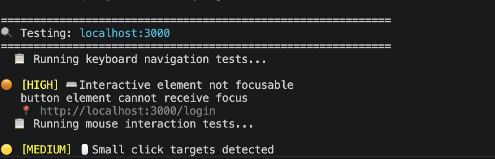
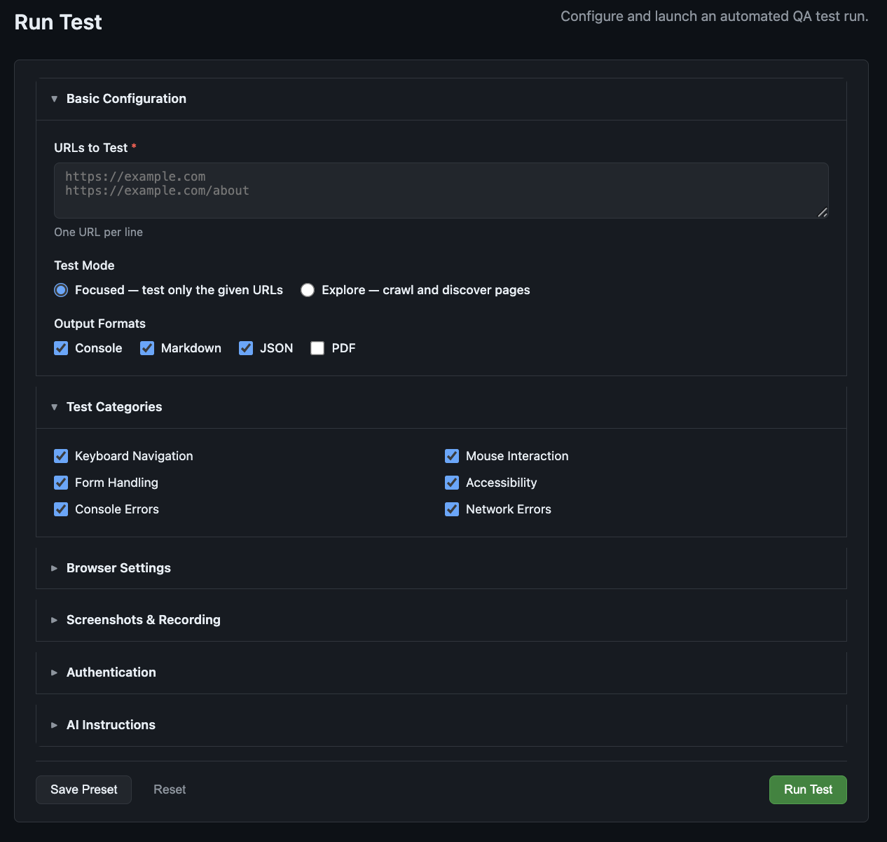
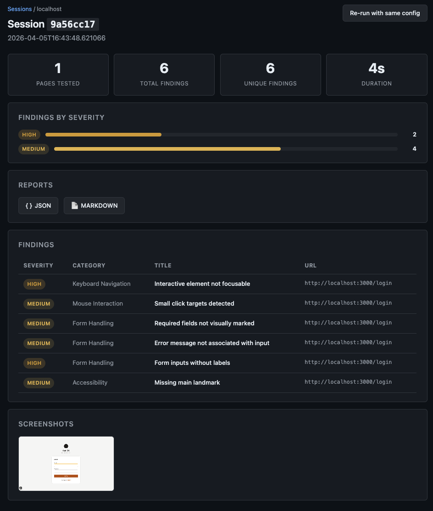
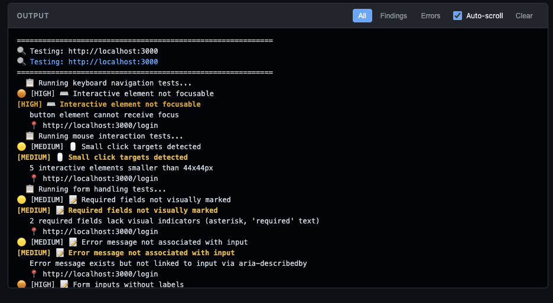

# QA Agent

Automated exploratory QA testing for web applications. Simulates real user interactions (mouse, keyboard, form input, accessibility checks) and optionally uses Claude to generate custom test steps from plain-English instructions.



---

## Table of Contents

- [Features](#features)
- [Installation](#installation)
- [Quick Start](#quick-start)
- [Agentic Testing](#agentic-testing)
- [Web Interface](#web-interface)
- [CLI Reference](#cli-reference)
- [Programmatic Usage](#programmatic-usage)
- [Test Categories](#test-categories)
- [Output Formats](#output-formats)
- [CI/CD Integration](#cicd-integration)
- [Architecture](#architecture)
- [Exit Codes](#exit-codes)

---

## Features

| Category | What it does |
|---|---|
| **Agentic testing** | Give Claude a bug report or feature spec; it generates custom Playwright test steps automatically |
| **Two modes** | `focused` tests only given URLs; `explore` crawls and discovers additional pages |
| **Five test suites** | Keyboard nav, mouse interaction, form handling, accessibility (WCAG), error detection |
| **Auth support** | Username/password, cookies, Bearer tokens, custom headers |
| **Four output formats** | Console, Markdown, JSON, PDF |
| **Screenshots & video** | On-error or every-interaction screenshots; full session video recording |
| **Web UI** | Browser-based dashboard for launching runs, watching live output, and browsing past sessions |

---

## Installation

```bash
# Core install
pip install qa-agent
playwright install chromium

# PDF report support
pip install "qa-agent[pdf]"

# Web UI support
pip install "qa-agent[web]"

# Everything
pip install "qa-agent[all]"
playwright install chromium
```

**Requirements:** Python 3.10+, Playwright ≥ 1.40

> **Note:** Playwright requires browser binaries installed separately after the Python package.
> Run `playwright install chromium` (or `playwright install` for all browsers) once after install.

**Agentic testing** requires an Anthropic API key:

```bash
export ANTHROPIC_API_KEY=sk-ant-...
```

---

## Quick Start

```bash
# Test a single URL
qa-agent https://example.com

# Test multiple URLs
qa-agent https://example.com https://example.com/about

# Crawl and test discovered pages (depth 2, up to 20 pages)
qa-agent --mode explore --max-depth 2 https://example.com

# Generate JSON + Markdown reports
qa-agent --output json,markdown https://example.com
```

---

## Agentic Testing

Pass natural-language instructions and Claude generates custom test steps that run alongside the standard suite.

```bash
# From a bug report
qa-agent --instructions "The login button does nothing when email is blank — no validation error is shown" \
  https://example.com/login

# From a feature description
qa-agent --instructions "We added a 'Remember me' checkbox to the login form. \
  It should persist the session across browser restarts and be unchecked by default." \
  https://example.com/login

# From a file (for longer specs)
qa-agent --instructions-file feature-spec.txt https://example.com
```

### What happens

1. Before any browser testing, Claude receives your instructions and the target URL.
2. Claude returns a structured plan: summary, focus areas, custom Playwright test steps, and suggested URLs.
3. The agent prints the plan, then runs those custom steps on every tested page alongside the five standard suites.
4. Assertion failures become findings in the report with the severity and category Claude assigned.

If the API call fails, a warning is printed and the run continues with standard tests only.

### Model & caching

```bash
# Use a different model (default: claude-sonnet-4-6)
qa-agent --ai-model claude-opus-4-6 --instructions "Test checkout" https://shop.example.com

# Bypass the plan cache and always call the API
qa-agent --no-cache --instructions "..." https://example.com
```

Generated test plans are cached by default; rerunning with the same instructions and URL reuses the cached plan.

---

## Web Interface



A browser-based dashboard for configuring and monitoring runs.

```bash
# Start the server (opens at http://127.0.0.1:5000)
python -m qa_agent web
# or
qa-agent-web

# Custom host/port
qa-agent-web --host 0.0.0.0 --port 8080
```

**Features:**
- Configuration form with all options (collapsible sections, preset save/load)
- Real-time streaming output via Server-Sent Events
- Stop a running test mid-run
- Browse past sessions grouped by domain
- Session detail: findings table, severity breakdown, screenshot gallery, report downloads



> The web interface has no authentication — intended for local or internal use only.

All output is written to `output/` in the project directory. CLI sessions are also visible in the web UI as long as JSON output format was used.

---

## CLI Reference

### Modes

```bash
qa-agent --mode focused https://example.com   # default: test only given URLs
qa-agent --mode explore  https://example.com   # crawl and test discovered pages
```

### Exploration options (explore mode)

| Flag | Default | Description |
|---|---|---|
| `--max-depth N` | `3` | Max link depth to follow |
| `--max-pages N` | `20` | Max pages to test |
| `--allow-external` | off | Follow links to other domains |
| `--ignore PATTERN` | — | Regex pattern(s) for URLs to skip (repeatable) |

### Authentication

```bash
# Username/password with login URL
qa-agent --auth "username:password@https://example.com/login" https://example.com/dashboard

# JSON auth file
qa-agent --auth-file auth.json https://example.com

# Pre-set cookies
qa-agent --cookies cookies.json https://example.com

# Custom header (repeatable)
qa-agent --header "Authorization: Bearer token123" https://example.com
```

**auth.json schema:**
```json
{
  "username": "testuser",
  "password": "testpass",
  "auth_url": "https://example.com/login",
  "username_selector": "input#email",
  "password_selector": "input#password",
  "submit_selector": "button[type=submit]"
}
```

### Output

```bash
# Formats: console, markdown, json, pdf (comma-separated, default: console,markdown)
qa-agent --output console,markdown,json,pdf https://example.com

# Custom output directory (default: <project-root>/output)
qa-agent --output-dir ./reports https://example.com
```

Output is organized as `output/{domain}/{session_id}/qa_reports|screenshots|recordings`.

> PDF requires `weasyprint`. Install with `pip install -e ".[pdf]"`. Falls back to Markdown if not installed.

### Screenshots & recording

```bash
qa-agent --screenshots       https://example.com  # capture on errors
qa-agent --screenshots-all   https://example.com  # capture after every interaction
qa-agent --full-page         https://example.com  # full-page screenshots
qa-agent --record            https://example.com  # record session video
```

### Browser options

```bash
qa-agent --no-headless                  # visible browser window
qa-agent --viewport 1920x1080           # custom viewport (default: 1280x720)
qa-agent --timeout 60000                # timeout in ms (default: 30000)
```

### Skip test categories

```bash
qa-agent --skip-keyboard      https://example.com
qa-agent --skip-mouse         https://example.com
qa-agent --skip-forms         https://example.com
qa-agent --skip-accessibility https://example.com
qa-agent --skip-errors        https://example.com
```

---

## Programmatic Usage

```python
from qa_agent import QAAgent, TestConfig, TestMode, OutputFormat

config = TestConfig(
    urls=["https://example.com"],
    mode=TestMode.EXPLORE,
    output_formats=[OutputFormat.CONSOLE, OutputFormat.JSON, OutputFormat.PDF],
    max_depth=2,
    max_pages=10,
    # Optional: agentic testing
    instructions="Verify the password reset flow sends an email and the link expires after 24 hours.",
    ai_model="claude-opus-4-6",
)

agent = QAAgent(config)
session = agent.run()

print(f"Pages tested:   {len(session.pages)}")
print(f"Total findings: {session.total_findings}")

for finding in session.get_all_findings():
    print(f"  [{finding.severity.value.upper()}] {finding.title}")
```

---

## Test Categories

### Keyboard Navigation
TAB order and focusability · Arrow key navigation in widgets · Enter key activation · Escape key for closing modals · Keyboard trap detection · Focus visibility indicators

### Mouse Interaction
Click target functionality · Hover states · Double-click behavior · Right-click/context menus · Click target sizes (WCAG 2.5.5 minimum 44×44 px) · Overlapping element detection

### Form Handling
Required field indicators · Input validation feedback · Error message accessibility · Label associations · HTML5 input types · Autocomplete attributes

### Accessibility (WCAG)
Image alt text · Heading structure (h1–h6) · Link text quality · Color contrast · ARIA usage · Landmark regions · Language attributes · Skip navigation links

### Error Detection
Console errors and warnings · Network errors (4xx, 5xx) · JavaScript exceptions · Broken images · Broken anchor links · Mixed content (HTTP on HTTPS)

---

## Output Formats

### Console



```
======================================================================
  QA AGENT TEST REPORT
======================================================================
  Session ID: a1b2c3d4
  Started:    2024-01-15 10:30:00
  Duration:   45.2 seconds
  Mode:       explore
======================================================================

SUMMARY
  Pages tested:   5
  Total findings: 12

  By Severity:
    HIGH:   2
    MEDIUM: 5
    LOW:    5
```

### JSON

```json
{
  "meta": {
    "session_id": "a1b2c3d4",
    "start_time": "2024-01-15T10:30:00",
    "duration_seconds": 45.2
  },
  "summary": {
    "pages_tested": 5,
    "total_findings": 12,
    "findings_by_severity": { "high": 2, "medium": 5, "low": 5 }
  },
  "findings": [...]
}
```

### Severity levels

| Level | Meaning |
|---|---|
| `CRITICAL` | Security issues, data loss |
| `HIGH` | Major usability blockers |
| `MEDIUM` | UX problems, accessibility issues |
| `LOW` | Minor improvements, best practices |
| `INFO` | Informational findings |

---

## CI/CD Integration

```yaml
# GitHub Actions example
- name: Run QA Tests
  env:
    ANTHROPIC_API_KEY: ${{ secrets.ANTHROPIC_API_KEY }}
  run: |
    pip install -e .
    playwright install chromium
    qa-agent --output json --output-dir ./qa-results https://staging.example.com

- name: Upload Results
  uses: actions/upload-artifact@v3
  with:
    name: qa-results
    path: ./qa-results/
```

The process exits with code `1` when critical or high severity issues are found, failing the CI step automatically.

---

## Architecture

```
qa_agent/
├── cli.py               # Argument parsing, entry point
├── agent.py             # Core orchestrator
├── config.py            # TestConfig, AuthConfig, ScreenshotConfig, RecordingConfig
├── models.py            # Finding, PageAnalysis, TestSession
├── ai_planner.py        # Claude integration (plan generation & caching)
├── plan_cache.py        # Plan cache persistence
├── testers/
│   ├── keyboard.py      # Keyboard navigation tests
│   ├── mouse.py         # Mouse interaction tests
│   ├── forms.py         # Form handling tests
│   ├── accessibility.py # WCAG / accessibility tests
│   └── errors.py        # Console & network error detection
└── reporters/
    ├── console.py       # Real-time colored output
    ├── markdown.py      # Markdown report
    ├── json_reporter.py # JSON report
    └── pdf.py           # PDF report (requires weasyprint)
```

### Adding a custom tester

1. Create `testers/my_tester.py` extending `BaseTester`, implement `run() -> list[Finding]`
2. Export it from `testers/__init__.py`
3. Add a `test_my_feature: bool = True` flag to `TestConfig` in `config.py`
4. Call it from `agent.py` in `_test_page()`

---

## Exit Codes

| Code | Meaning |
|---|---|
| `0` | All tests passed (no critical/high findings) |
| `1` | Critical or high severity issues found |
| `2` | Error running tests |
| `130` | Interrupted by user (Ctrl+C) |

---

## License

MIT
